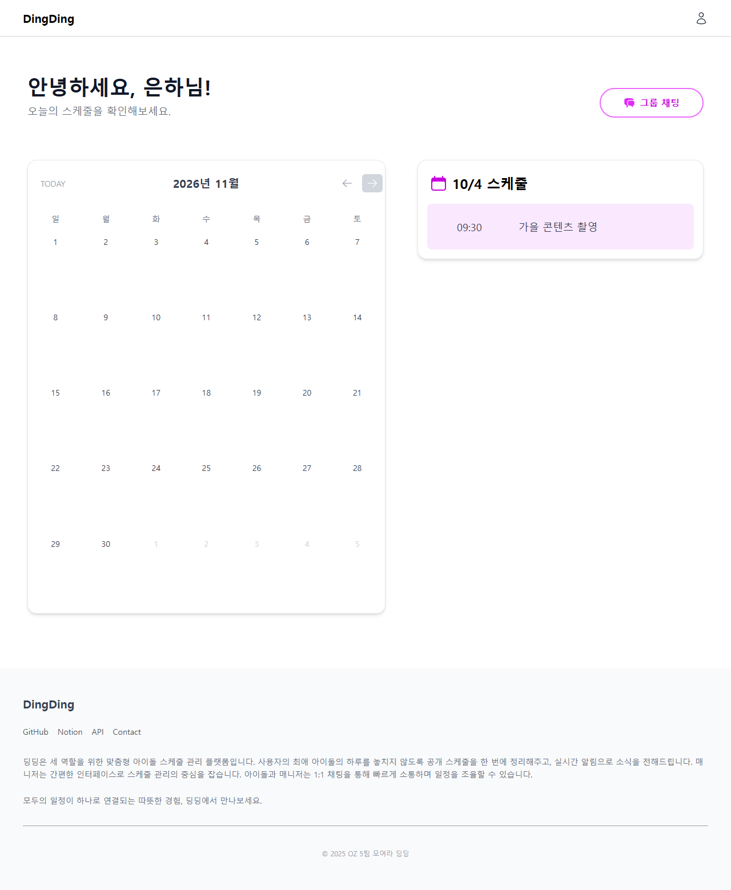
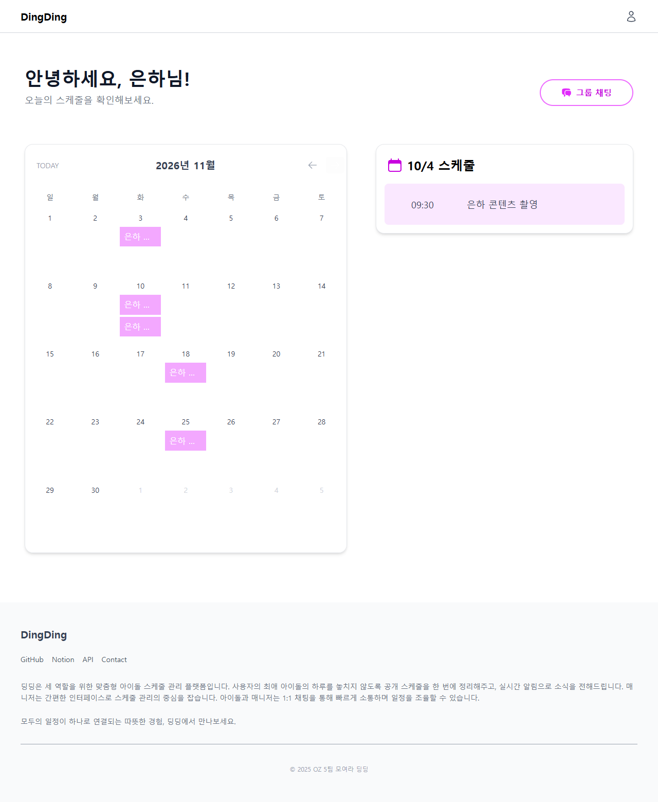
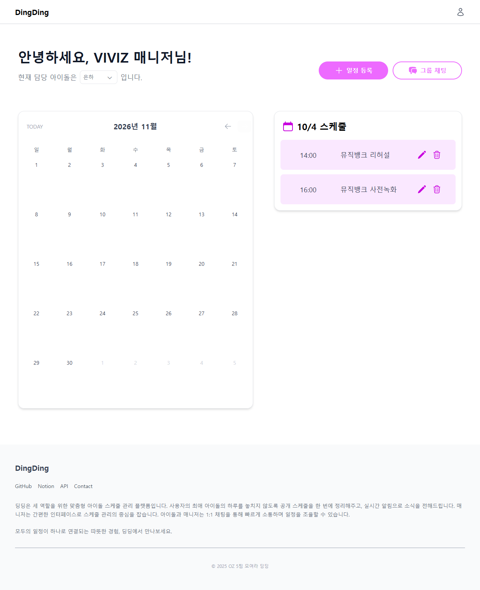
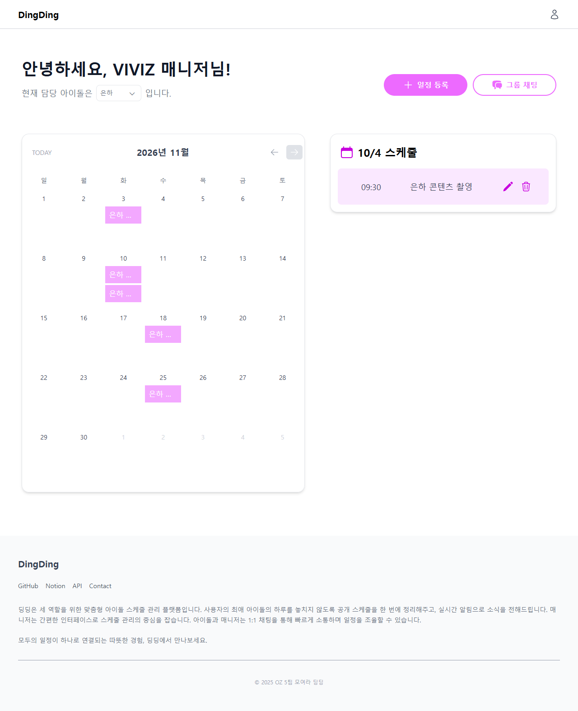
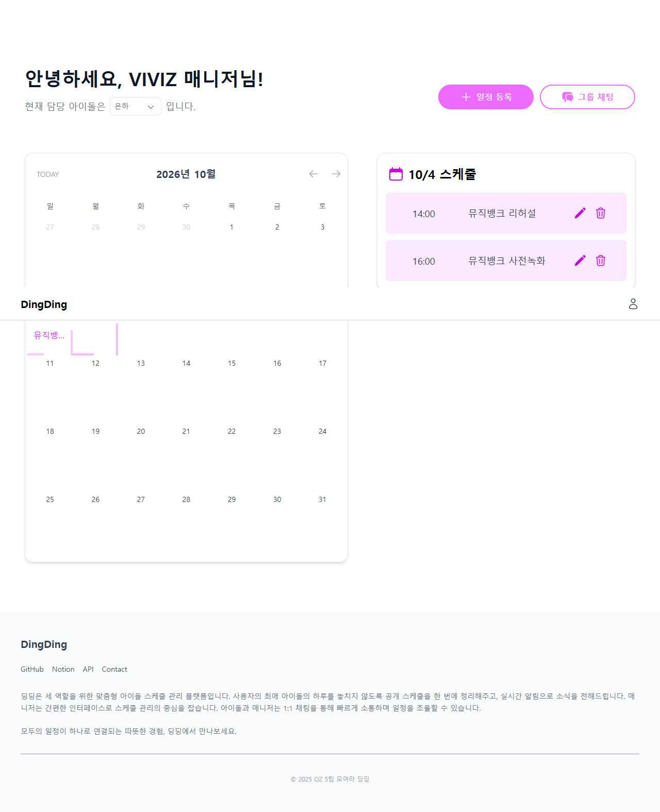
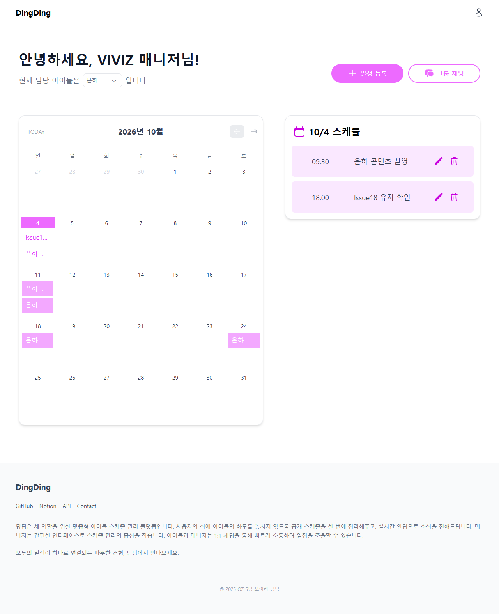
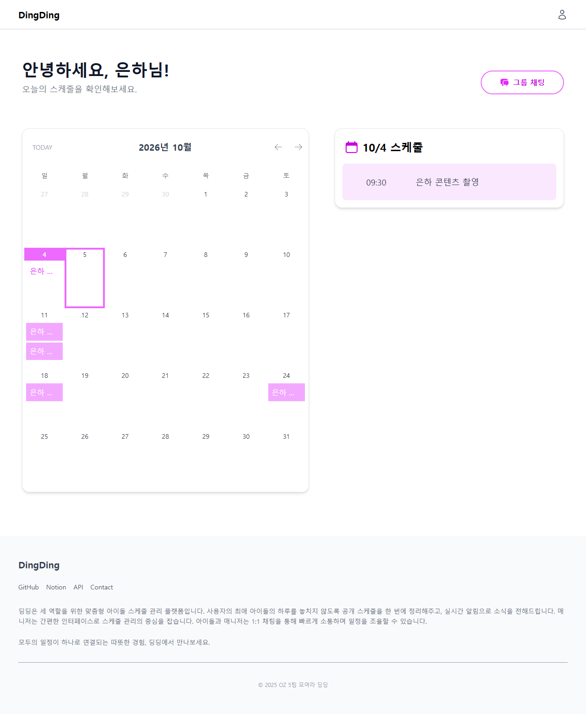

# Issue #18 달력 일정 회귀 검증

- 요구사항: [Issue #18](https://github.com/sysysysyb/moyeoradingding/issues/18)
- 검증일: 2026-10-04 KST
- Red 기준: `c9fb7e7524d96f8f89c370185dfda252dc5f23e5`
- Green 대상: `fix/18-calendar-schedule-persistence`의 커밋 전 작업 트리
- 환경: 로컬 Vite 개발 서버, Chrome, MSW 데모 모드. 실제 로그인 화면의 역할별 데모 로그인 버튼 사용.
- R1–R5는 Issue 완료 조건의 순서에 붙인 이 문서의 식별자다.

## 변경 책임과 불변식

- 아이돌: `useIdolMainData`의 전체 일정은 달력으로 전달하고, 선택 날짜는 일별 목록만 필터링한다. 달력 표시 월과 선택 날짜는 기존처럼 독립적이다.
- 매니저: `createMockManagerSchedules`는 기존 이전·현재·다음 달 템플릿과 날짜·ID 생성 함수를 재사용한다. VIVIZ의 은하·신비·엄지 각각 월별 5개, 총 15개의 기본 일정을 만든다. 과거의 선택 날짜마다 나타나는 임시 일정 2개를 고정 날짜의 월별 일정으로 대체한다.
- 매니저 상태: 화면 마운트 시 초기화하고 함수형 상태 갱신으로 등록·수정·삭제한다. 날짜·월 이동은 초기화하지 않으며 담당 아이돌 선택은 같은 목록에 ID 필터만 적용한다.
- 팬: 기존 아이돌을 명시한 조회의 이름·ID와 즐겨찾기 상태를 유지한다. 매니저 일정은 별도 화면 상태로 유지된다. 아래 사용자 승인 후속 수정으로 은하(VIVIZ) 데모 항목이 목록에 추가됐다.
- 유지 범위: 현재 매니저 화면의 마운트된 세션. 새로고침·화면 이탈 후 저장은 요구 범위 밖이다.

## Red / Green 관찰

| 요구사항 | 변경 전 관찰 | 변경 후 관찰 |
| --- | --- | --- |
| R1 월별 표시 | `/main/idol`, `/main/manager`에서 10월 → 11월 이동 직후 달력에 11월 일정이 없음 | 두 역할 모두 날짜 클릭 없이 9·10·11월 일정 표시. 현재 달 복귀 시 기존 일정 표시 |
| R2 목록 보존 | 매니저 날짜 선택 시 기본 2개 일정이 선택 날짜로 이동하며 목록을 교체 | 빈 날짜 선택 시 일별 목록만 비고 다른 날짜의 기본 일정은 유지 |
| R3 CRUD 유지 | 매니저 10/4에 `Issue18 유지 확인` 등록 후 10/5 → 10/4 왕복하면 등록 일정 소실 | 등록 후 날짜·월 왕복 유지. 제목 수정 및 11/10으로 날짜 변경 후에도 왕복 유지. 삭제 후 왕복해도 복원되지 않음 |
| R4 팬 회귀 | 기존 여러 달 mock 일정과 일별 목록이 비교 기준 | `/idols/11`에서 9·10·11월 이동, 여러 일정의 일별 목록, TODAY, 빈 날짜 표시 유지 |
| R5 회귀 근거 | 위 두 결함을 수정 전 실제 UI에서 재현 | 이 문서의 재검증 절차와 아래 변경 전후 화면 보존 |

추가로 매니저 기본 일정의 수정·삭제 유지, 은하 → 신비 → 엄지 → 은하 전환 시 해당 아이돌 일정 분리, 담당 아이돌 왕복 후 기본 일정 수정 결과 유지를 확인했다. 삭제된 기본 일정은 날짜·월 왕복 후에도 다시 생성되지 않았다.

### 아이돌 월 이동 직후

날짜를 클릭하지 않은 11월 달력이다. 일별 목록은 선택된 10/4를 유지하는 것이 기존 동작이다.

| Red | Green |
| --- | --- |
|  |  |

### 매니저 월 이동 직후

| Red | Green |
| --- | --- |
|  |  |

### 매니저 등록 후 날짜 왕복

등록한 `Issue18 유지 확인` 일정이 Red에서는 사라지고 Green에서는 기본 일정과 함께 남아 있다. 기본 일정의 구성은 월별 템플릿으로 바뀌었다.

| Red | Green |
| --- | --- |
|  |  |

## 재검증 절차

1. `npm run dev`로 데모를 실행하고 로그인 화면에서 아이돌을 선택한다. 날짜를 클릭하기 전에 이전·현재·다음 달을 왕복해 일정 표시를 확인한다. 일정 있는 날짜를 선택해 일별 목록과 비교하고 TODAY와 빈 날짜도 확인한다.
2. 매니저 데모로 로그인해 같은 월·날짜 검증을 반복한다. 원하는 날짜에 제목·날짜·시간을 지정해 일정을 등록한다. 다른 날짜 및 월을 선택하고 돌아와 달력과 일별 목록 모두에서 등록 결과를 확인한다.
3. 등록한 일정의 제목과 날짜를 다음 달로 수정한다. 이전 날짜에는 없어지고 새 날짜에는 기본 일정과 함께 나타나는지 확인한다. 날짜·월 왕복 후 수정 결과를 확인한다.
4. 수정한 일정을 삭제한 뒤 날짜·월을 왕복한다. 삭제 결과가 유지되고 다른 기본 일정이 남는지 확인한다. 기본 일정에도 수정·삭제를 반복한다.
5. 담당 아이돌을 은하·신비·엄지로 전환한다. 현재 담당 아이돌의 일정만 표시되고, 원래 아이돌로 돌아올 때 변경 결과가 유지되는지 확인한다.
6. 팬 데모로 로그인해 아이돌 상세 달력에서 월 왕복, 일별 목록, TODAY와 빈 날짜를 확인한다. 콘솔과 네트워크를 점검한다.

## 검증 결과와 한계

- 변경 소스 4개에 대한 `npx --no-install eslint` 통과.
- `npm run lint` 통과. 기존 전체 lint 실패 없음.
- `npm run build` 통과: `tsc -b`와 production 번들 검증을 함께 수행. 500kB 초과 chunk 경고는 남아 있으며 이 Issue에서 번들 구조를 변경하지 않았다.
- 자동 테스트: 저장소에 테스트 스크립트·러너가 없어 미구성. 새 테스트 의존성은 추가하지 않았고 Playwright CLI로 실제 UI 동작을 확인했다.
- 정상 흐름의 브라우저 콘솔 오류·경고 0건. 검증한 API 요청은 로컬 MSW의 로그인·프로필·즐겨찾기·일정 조회 경로이며 예상 밖 API 요청은 관찰되지 않았다.
- 세 역할의 빈 날짜 표시를 확인했다. HTTP 실패 주입과 지연 로딩 상태는 별도로 검증하지 않았다. 아이돌의 기존 실패 시 빈 목록 fallback을 유지하며 매니저는 새 비동기 조회를 추가하지 않았다.
- 라우팅·배포 변경이 없으므로 중첩 경로 새로고침 검증은 수행하지 않았다. 이 흐름에 새 선택적 외부 서비스 의존성을 추가하지 않았고 별도 서비스 장애 주입은 수행하지 않았다.
- 코드 리뷰: 시작 기준 대비 작업 트리를 Standards·Spec 두 축에서 독립 검토. Standards 규칙 위반·보고할 코드 냄새 0건, Spec 소스 결함·범위 초과 0건.

## 사용자 승인 후속 수정: 은하 데모 일정

사용자가 인사말 `은하`와 기본 일정 `가을`의 불일치를 수정하도록 추가 요청했다. Issue #18의 달력 수정과 구분해 PR에서 별도 보고할 소규모 후속 변경이다.

- `src/mocks/data/idols.ts::DEMO_IDOL`: 은하(VIVIZ)를 ID `10001`로 명시한다. 기존 아이돌의 ID 생성 순서는 유지하고 데모 항목만 추가한다. 팬 목록에서도 은하를 검색하고 상세를 조회할 수 있다.
- `src/mocks/data/schedules.ts::getMockIdolSchedules`: 아이돌 ID가 생략된 기본 조회는 `DEMO_IDOL.id`를 선택한다. 기존 월별 템플릿으로 은하 일정 15개를 제공한다.
- 변경 전: `안녕하세요, 은하님!` 인사말 아래 가을 일정 표시. 변경 후: 인사말과 달력·일별 목록 모두 은하 표시. 위 아이돌 Green 화면은 후속 수정까지 반영한 최종 화면이다.
- 브라우저: 아이돌 데모 로그인, 9·10·11월 왕복과 각 월의 일별 목록, 빈 날짜 통과. 기본 MSW 응답의 15개 일정 제목이 모두 `은하 `로 시작하고 `idol`이 `10001`임을 확인했다.
- 팬 회귀: 기존 가을(ID `11`)의 일정 15개와 상세 표시를 확인했다. 은하(ID `10001`) 상세 페이지도 이름과 일정이 일치한다.
- 변경 파일 ESLint, 전체 lint와 TypeScript/build 재검증 통과. 기존 500kB 초과 chunk 경고 유지. 후속 Standards·Spec 리뷰에서 발견 사항 0건. 자동 테스트 러너는 추가하지 않았다.
- 후속 검증 콘솔 오류·경고 0건, 예상 밖 API 요청 없음.

## 커밋과 승인 상태

- 2026-10-05 사용자가 구현 검토를 마치고 로컬 커밋을 승인했다.
- Issue #18 커밋: `db05df0` — `🐛 Fix: 아이돌·매니저 달력 일정 표시와 데모 변경 유지 (#18)`
- 별도 후속 커밋 제목: `🐛 Fix: 아이돌 데모 일정을 은하와 일치하도록 수정`
- push·PR 생성·병합·Issue 종료는 수행하지 않았다. 승인 후 PR은 `dev` 대상으로 만들고 rebase merge한다.
